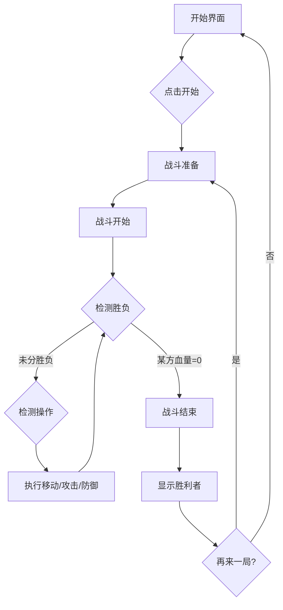

# 像素风机甲对战游戏 - 产品需求文档

## 1. 产品概述

一款复古像素风格的双人对战机甲对战小游戏。玩家可以操控两个独特的机甲角色进行战斗，支持移动、攻击、防御等操作，通过削减对方血量决出胜负。游戏采用经典的像素艺术风格，营造80年代街机游戏的怀旧氛围。

### 核心目标
- 提供简单易上手的对战操作体验
- 展现复古像素艺术的视觉魅力
- 实现流畅的格斗打击感和角色动画

### 目标用户
- 休闲游戏玩家
- 像素游戏爱好者
- 喜欢本地双人游戏的用户

---

## 2. 核心功能

### 2.1 机甲角色系统

| 机甲 | 名称 | 特点 | 颜色方案 |
|------|------|------|----------|
| 机甲A | 铁拳 (Iron Fist) | 攻击型，攻击力高，防御较低 | 红色 + 金色 |
| 机甲B | 铁壁 (Iron Wall) | 防御型，攻击力中等，防御高 | 蓝色 + 银色 |

### 2.2 战斗操作

#### 玩家1 (左侧机甲 - 铁拳)
| 按键 | 动作 |
|------|------|
| A | 向左移动 |
| D | 向右移动 |
| W | 跳跃 |
| F | 攻击 |
| G | 防御 |

#### 玩家2 (右侧机甲 - 铁壁)
| 按键 | 动作 |
|------|------|
| ← | 向左移动 |
| → | 向右移动 |
| ↑ | 跳跃 |
| J | 攻击 |
| K | 防御 |

### 2.3 战斗机制

#### 生命值系统
- 每个机甲初始血量: 100点
- 血量显示: 像素风格的血条UI
- 当血量归零时，该机甲战败

#### 攻击系统
- 普通攻击伤害: 10-15点 (随机)
- 防御状态减伤: 70%
- 攻击间隔: 500ms (防止连击过快)

#### 防御系统
- 防御姿态: 减少70%受到的伤害
- 防御消耗: 无限制 (简化设计)
- 防御动画: 机甲举起盾牌

#### 移动系统
- 水平移动速度: 5px/帧
- 跳跃高度: 100px
- 跳跃下落: 重力加速度模拟
- 移动限制: 不能超出战场边界

### 2.4 游戏状态

| 状态 | 描述 |
|------|------|
| 开始界面 | 显示游戏标题和"开始游戏"按钮 |
| 战斗中 | 双方机甲对战，血量实时更新 |
| 结束界面 | 显示胜利者，"再来一局"按钮 |

---

## 3. 用户界面设计

### 3.1 整体风格
- **美术风格**: 复古像素艺术 (8-bit / 16-bit)
- **分辨率**: 低分辨率渲染后放大至全屏 (像素完美)
- **帧率**: 60 FPS 动画

### 3.2 色彩方案

#### 主色调
- 背景色: `#1a1a2e` (深蓝紫色夜空)
- 地面色: `#16213e` (深蓝)
- 装饰色: `#0f3460` (中蓝)

#### 机甲配色
- 铁拳: `#e94560` (红) + `#f9b208` (金)
- 铁壁: `#00d9ff` (青蓝) + `#c0c0c0` (银)

#### UI配色
- 血条背景: `#333333`
- 血条填充: `#4ade80` (绿色高血量) → `#fbbf24` (黄色中血量) → `#ef4444` (红色低血量)
- 文字色: `#ffffff`
- 强调色: `#f472b6` (粉色)

### 3.3 视觉元素

#### 战场背景
- 像素风格城市废墟剪影
- 星空背景粒子效果
- 霓虹灯色调的装饰元素

#### 机甲设计 (CSS绘制)
- 16x24 像素网格绘制
- 简单的方块人形设计
- 明显的颜色区分
- 帧动画: 待机、移动、攻击、防御、受伤

#### 特效
- 攻击时的像素火花
- 防御时的闪光
- 受伤时的闪烁效果
- 胜利时的粒子庆祝效果

### 3.4 布局结构

```
┌─────────────────────────────────────────────┐
│                 游戏标题                      │
├─────────────────────────────────────────────┤
│  [P1血条]                      [P2血条]      │
├─────────────────────────────────────────────┤
│                                             │
│     ┌───┐                         ┌───┐     │
│     │机甲│                         │机甲│     │
│     │ A │         VS              │ B │     │
│     └───┘                         └───┘     │
│  ▓▓▓▓▓▓▓▓▓▓▓▓▓▓▓▓▓▓▓▓▓▓▓▓▓▓▓▓▓▓▓▓▓▓▓▓▓▓▓  │
├─────────────────────────────────────────────┤
│          [操作提示]                          │
│   P1: WASD移动 F攻击 G防御                   │
│   P2: 方向键移动 J攻击 K防御                 │
└─────────────────────────────────────────────┘
```

---

## 4. 核心流程

### 4.1 游戏流程图



### 4.2 游戏循环

```
每帧执行 (60 FPS):
1. 读取输入状态
2. 更新机甲位置
3. 检测碰撞 (机甲间、机甲与边界)
4. 处理攻击判定
5. 更新血量
6. 检测胜负
7. 渲染画面
```

---

## 5. 技术需求

### 5.1 性能目标
- 60 FPS 流畅运行
- 输入延迟 < 16ms
- 像素完美渲染 (无抗锯齿)

### 5.2 浏览器兼容
- Chrome / Firefox / Safari / Edge 最新版
- 支持键盘输入

---

## 6. 验收标准

### 6.1 功能验收
- [ ] 两个机甲可以独立控制移动
- [ ] 攻击可以造成伤害
- [ ] 防御可以减少伤害
- [ ] 血量归零时显示胜负
- [ ] 可以重新开始游戏

### 6.2 视觉验收
- [ ] 像素风格清晰可见
- [ ] 动画流畅无卡顿
- [ ] 血条实时更新
- [ ] 特效可见

### 6.3 操作验收
- [ ] 键盘响应及时
- [ ] 两个玩家可同时操作
- [ ] 操作提示清晰可见
