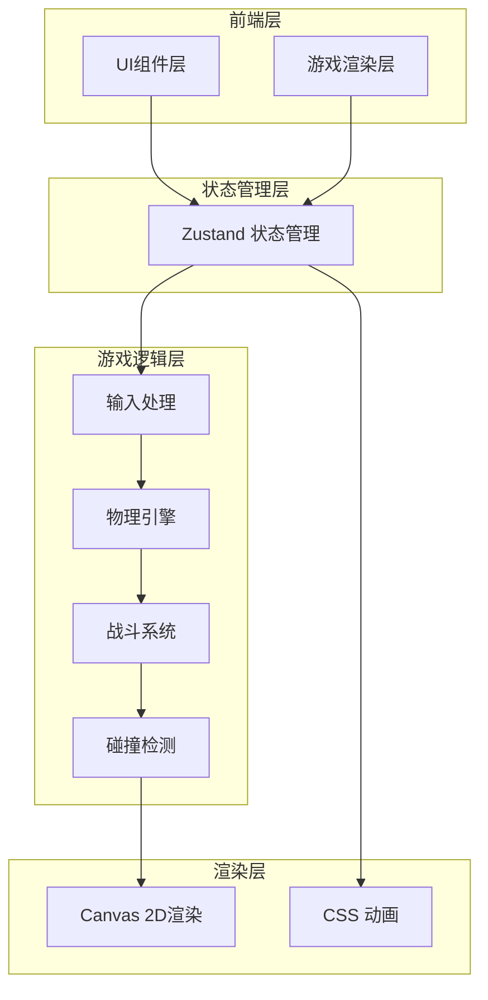

# 像素风机甲对战游戏 - 技术架构文档

## 1. 架构设计



## 2. 技术选型

| 技术 | 版本 | 用途 |
|------|------|------|
| React | 18.x | UI框架 |
| TypeScript | 5.x | 类型安全 |
| Vite | 5.x | 构建工具 |
| Zustand | 4.x | 状态管理 |
| TailwindCSS | 3.x | 样式框架 |

## 3. 项目结构

```
src/
├── components/
│   ├── Game/
│   │   ├── GameCanvas.tsx      # 游戏画布主组件
│   │   ├── Mech.tsx            # 机甲渲染组件
│   │   ├── HealthBar.tsx       # 血条组件
│   │   ├── BattleField.tsx     # 战场背景
│   │   └── Effects.tsx         # 特效组件
│   ├── UI/
│   │   ├── StartScreen.tsx     # 开始界面
│   │   ├── EndScreen.tsx       # 结束界面
│   │   ├── ControlHint.tsx     # 操作提示
│   │   └── Title.tsx           # 游戏标题
│   └── Layout/
│       └── GameLayout.tsx      # 整体布局
├── stores/
│   └── gameStore.ts            # 游戏状态管理
├── hooks/
│   ├── useGameLoop.ts          # 游戏循环钩子
│   ├── useKeyboard.ts          # 键盘输入钩子
│   └── useCollision.ts         # 碰撞检测钩子
├── utils/
│   ├── physics.ts              # 物理计算工具
│   ├── combat.ts               # 战斗计算工具
│   └── constants.ts            # 游戏常量
├── types/
│   └── game.ts                 # 游戏类型定义
├── App.tsx
└── main.tsx
```

## 4. 类型定义

```typescript
// 机甲类型
interface Mech {
  id: 'player1' | 'player2';
  name: string;
  x: number;
  y: number;
  velocityX: number;
  velocityY: number;
  health: number;
  maxHealth: number;
  isDefending: boolean;
  isAttacking: boolean;
  isHit: boolean;
  facingRight: boolean;
  lastAttackTime: number;
}

// 游戏状态
interface GameState {
  status: 'start' | 'playing' | 'ended';
  winner: 'player1' | 'player2' | null;
  mechs: {
    player1: Mech;
    player2: Mech;
  };
  effects: Effect[];
}

// 操作按键
interface Controls {
  left: boolean;
  right: boolean;
  up: boolean;
  attack: boolean;
  defend: boolean;
}

// 特效
interface Effect {
  id: string;
  type: 'hit' | 'defend' | 'victory';
  x: number;
  y: number;
  frame: number;
}
```

## 5. 核心游戏循环

```typescript
// 游戏循环伪代码
function gameLoop() {
  // 1. 处理输入
  handleInput();
  
  // 2. 更新物理
  updatePhysics();
  
  // 3. 检测碰撞
  checkCollisions();
  
  // 4. 处理战斗
  handleCombat();
  
  // 5. 更新特效
  updateEffects();
  
  // 6. 检测胜负
  checkWinCondition();
  
  // 7. 渲染
  render();
  
  requestAnimationFrame(gameLoop);
}
```

## 6. 常量定义

```typescript
export const GAME_CONFIG = {
  // 战场尺寸
  FIELD_WIDTH: 800,
  FIELD_HEIGHT: 400,
  GROUND_Y: 320,
  
  // 机甲尺寸
  MECH_WIDTH: 48,
  MECH_HEIGHT: 64,
  
  // 物理参数
  MOVE_SPEED: 5,
  JUMP_FORCE: -15,
  GRAVITY: 0.8,
  
  // 战斗参数
  MAX_HEALTH: 100,
  ATTACK_DAMAGE: { min: 10, max: 15 },
  ATTACK_RANGE: 60,
  ATTACK_COOLDOWN: 500,
  DEFENSE_REDUCTION: 0.7,
};

export const CONTROLS = {
  player1: {
    left: 'KeyA',
    right: 'KeyD',
    up: 'KeyW',
    attack: 'KeyF',
    defend: 'KeyG',
  },
  player2: {
    left: 'ArrowLeft',
    right: 'ArrowRight',
    up: 'ArrowUp',
    attack: 'KeyJ',
    defend: 'KeyK',
  },
};
```

## 7. 组件说明

### 7.1 GameCanvas
- 游戏主画布组件
- 使用 requestAnimationFrame 驱动游戏循环
- 管理所有游戏对象的渲染

### 7.2 Mech
- 单个机甲的渲染组件
- 根据状态显示不同动画帧
- CSS绘制像素风格机甲

### 7.3 HealthBar
- 血条组件
- 根据血量百分比改变颜色
- 像素风格边框

### 7.4 BattleField
- 战场背景组件
- 包含像素风格城市剪影
- 星空背景效果

### 7.5 gameStore (Zustand)
```typescript
interface GameStore {
  // 状态
  gameStatus: 'start' | 'playing' | 'ended';
  winner: 'player1' | 'player2' | null;
  mechs: Record<'player1' | 'player2', Mech>;
  effects: Effect[];
  
  // 操作
  startGame: () => void;
  resetGame: () => void;
  updateMech: (id: string, updates: Partial<Mech>) => void;
  addEffect: (effect: Effect) => void;
  removeEffect: (id: string) => void;
}
```

## 8. 像素风格实现

### 8.1 CSS像素化设置
```css
.pixel-mech {
  image-rendering: pixelated;
  image-rendering: crisp-edges;
}
```

### 8.2 像素绘制
- 使用 CSS box-shadow 绘制像素图案
- 每个像素为 3x3 或 4x4 的方块
- 缩放比例 4x 以保持清晰

### 8.3 动画帧
- 待机: 2帧循环
- 移动: 4帧循环
- 攻击: 3帧
- 防御: 1帧
- 受伤: 2帧闪烁
